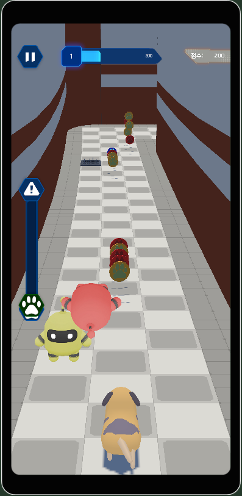
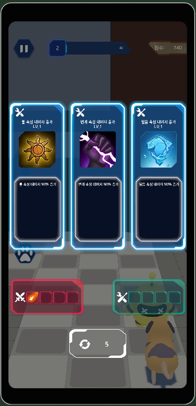
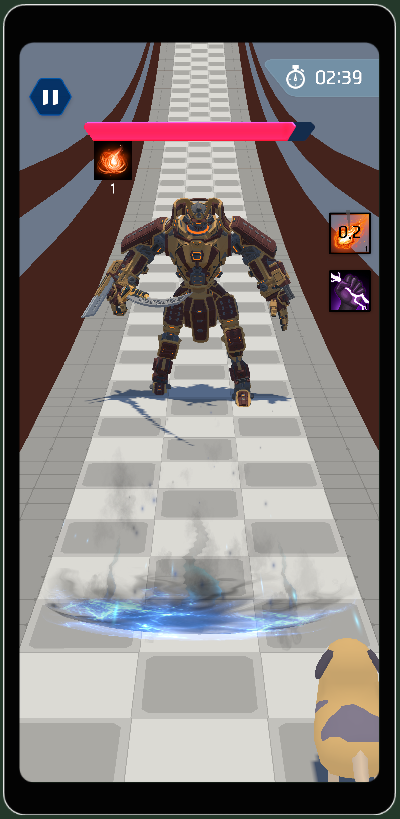
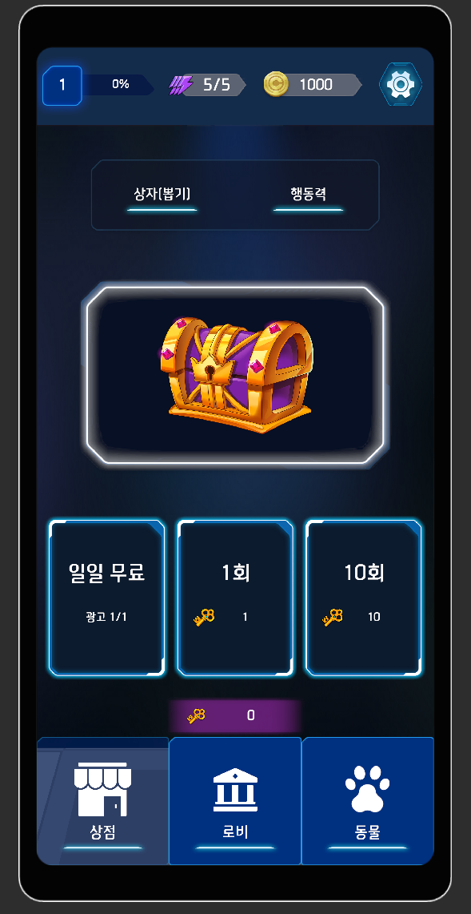
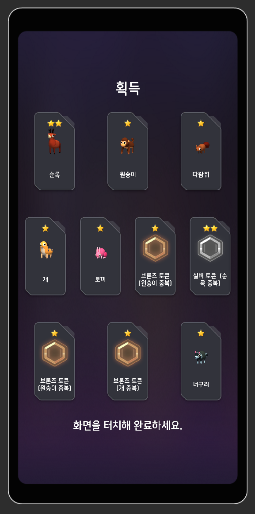
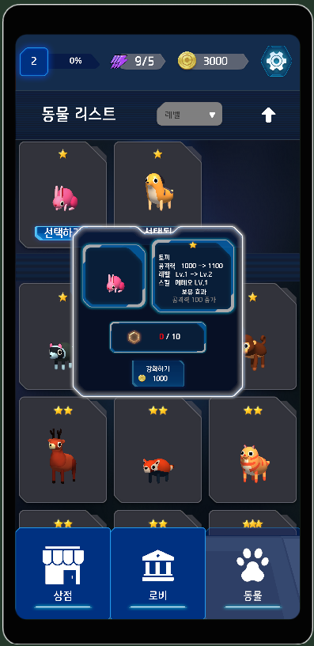
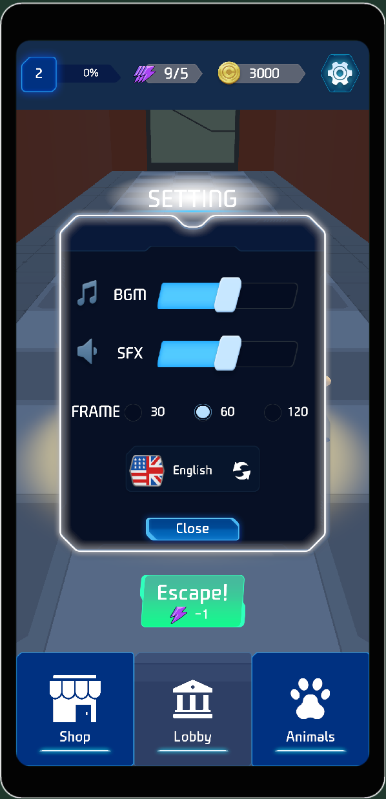
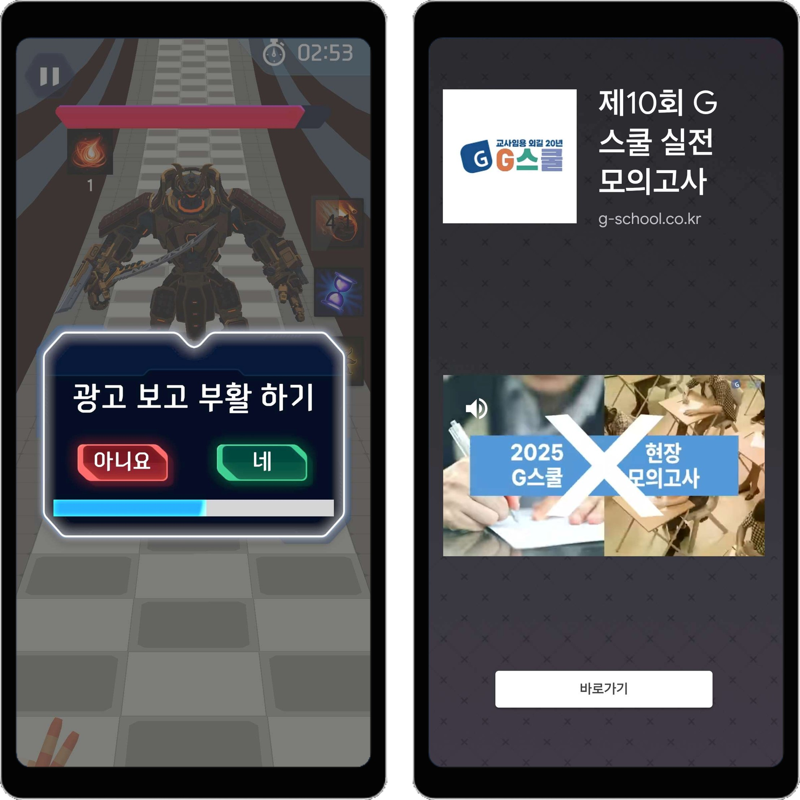

#  🐕Animal Breakout

🛠️ **개발 도구**
    

📅 **개발 기간**
 25.03.20 ~ 25.05.19 (9주)

🧑‍💻 **개발진**
   

👉 [구글 플레이스토어 출시](https://play.google.com/store/apps/details?id=com.Kyungil.AnimalBreakOut&pcampaignid=web_share)

유니티로 제작한 모바일 3D 런 게임 프로젝트입니다.

> 장애물을 피하고, 코인을 섭취하며 달리세요.  
> 달리면서 얻은 스킬로 보스를 물리쳐야 합니다.  
> 캐릭터를 뽑고, 강화할 수 있습니다.

---

## 🛠️ 주요 구현 요소
<table>
  <tr>
    <td align="center"><strong>스와이프로 레인 이동, 점프</strong></td>
    <td align="center"><strong>스킬 선택</strong></td>
    <td align="center"><strong>보스 전투</strong></td>
  </tr>
  <tr>
    <td></td>
    <td></td>
    <td></td>
  </tr>
</table>

<table>
  <tr>
    <td align="center"><strong>동물 캐릭터 가챠</strong></td>
    <td align="center"><strong>동물 강화</strong></td>
  </tr>
  <tr>
    <td></td>
    <td></td>
  </tr>
 
</table>
<table>
  <tr>
    <td align="center"><strong>로컬라이제이션</strong></td>
    <td align="center"><strong>애드몹 보상 광고</strong></td>
  </tr>
  <tr>
    <td></td>
    <td></td>
  </tr>
</table>

- **구글 애드몹 연동하여 보상형 광고** 구현

- **개발 툴**
  - 게임 오브젝트를 캡처해 png파일로 생성하는 **아이콘 이미지 캡처 툴** 개발 👉 [SaveTextureToFileUtility.cs](https://github.com/KALI-UM/Unity-AnimalBreakOut/blob/main/Assets/Scripts/IconStudio/SaveTextureToFileUtility.cs)
  - **유니티 웹리퀘스트**를 활용해 최신 데이터 테이블 파일로 갱신하는 **데이터 테이블 갱신 툴** 구현 👉 현 👉 [PlayerLoadManager.cs](https://github.com/KALI-UM/Unity-AnimalBreakOut/blob/main/Assets/Scripts/Managers/PlayerLoadManager.cs)
 
   
 

